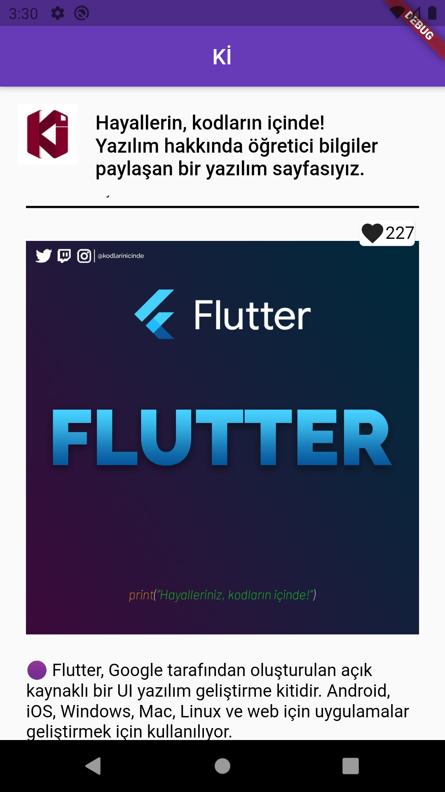

# flutter_bloc_sample

Hello there, i want to make a simple application which is show my favourite instagram page's posts, and some account informations.
---

I used:
+ [Cubit(bloc)](https://pub.dev/packages/flutter_bloc) for state management,
+ [Http](https://pub.dev/packages/http) for fetching datas.
+ [Swiper](https://pub.dev/packages/flutter_swiper) for showing multi image posts.

---

I was inspired to [Veli Bacik's kartal package](https://github.com/VB10/kartal) and write [context extension](lib/constants/extensions/context_extension.dart).

---

